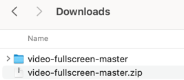
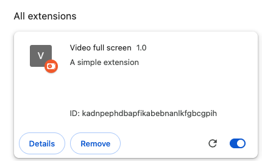
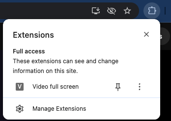
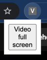

# Video full screen

This simple extension allows you to play videos in full screen mode on any website.

## Manual installation
1. Clone this repository to your local machine using the Terminal or just download the ZIP file and extract it: [download](https://github.com/feczkob/video-fullscreen/archive/refs/heads/master.zip).
```bash
git clone https://github.com/feczkob/video-fullscreen.git
```


2. Open Chrome and go to in the address bar type `chrome://extensions/` and hit enter.

3. Enable 'Developer mode' in the top right corner.


4. Click on 'Load unpacked' in the top left and select the cloned/downloaded and extracted repository. Click on 'Select'.


5. The extension should now be installed and active.



## Usage
1. Open Chrome and navigate to any website with a video.
2. Click on the 'Video full screen' extension icon in the toolbar (top right). You may even pin the extension to the toolbar for easier access.



3. Click on the popup button.


